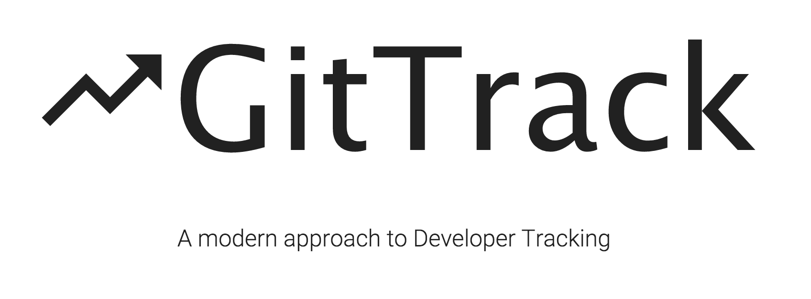
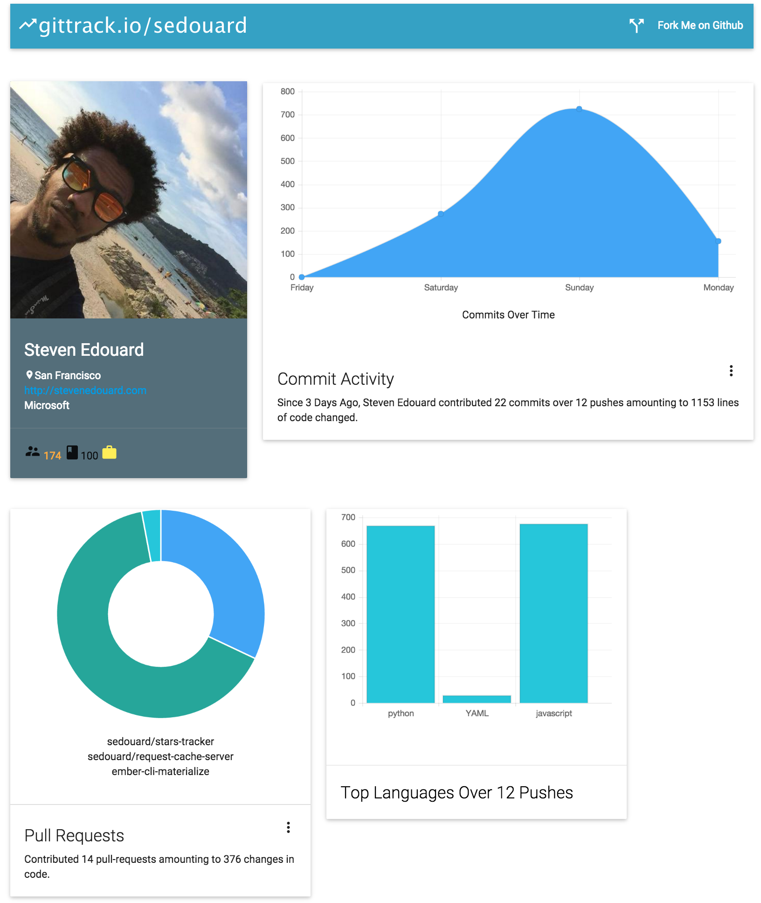

# What is GitTrack?

GitTrack is a heads-up-display of your activity on Github.

# Getting a GitTrack

To generate your GitTrack, just star this repo and visit [gittrack.io](http://gittrack.io)

# Contributing

Contributions are always welcome! See the [contributing guide](./CONTRIBUTING.md)

# License

This project is MIT licensed. See the [license file](./LICENSE.md) for more details.
